# Calculating Bias and Variance


| degree |        bias        |       bias^2       |             variance |
| ------ | :----------------: | :----------------: | -------------------: |
| 1      | 5.762004977106394  | 33.200701356198856 |  0.06813784764282667 |
| 2      | 2.478024059519654  | 6.140603239558267  |  0.03547737334627103 |
| 3      | 2.2866329167364703 | 5.2286900959027385 |  0.03887331533306583 |
| 4      | 1.7852153309964875 | 3.1869937780248985 |  0.03532645581636562 |
| 5      | 1.7532037198422301 | 3.073723283268633  |  0.03640071365460347 |
| 6      | 1.6267362298588575 | 2.6462707615354093 | 0.027829188583609117 |
| 7      | 1.586570068456243  | 2.5172045821212476 |  0.03689944857893139 |
| 8      | 1.584120900633274  | 2.509439027823175  |  0.05605927046852004 |
| 9      | 1.579771545399173  | 2.495678135652891  |  0.06733486021975807 |

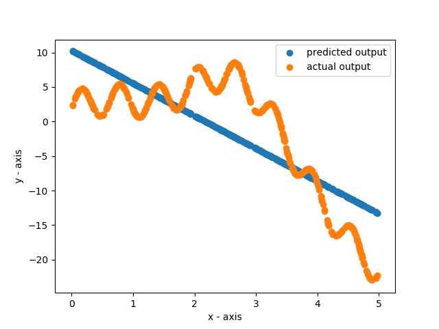
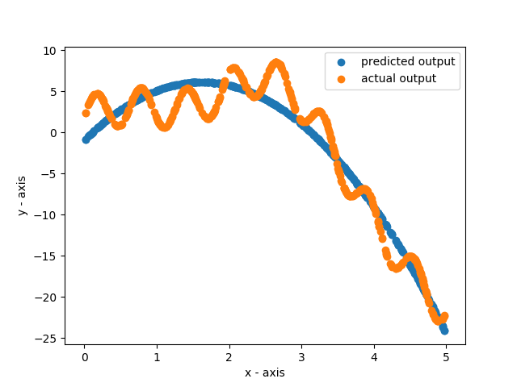
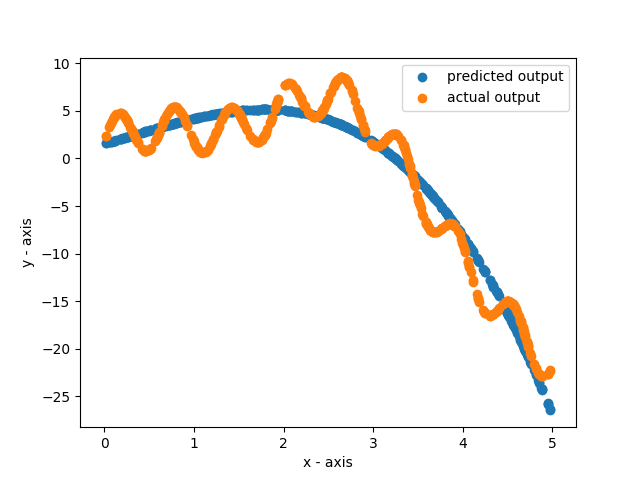

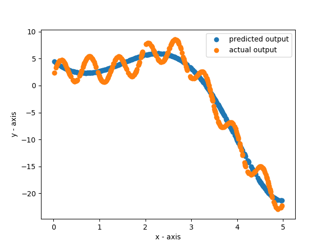
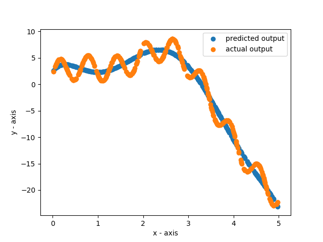

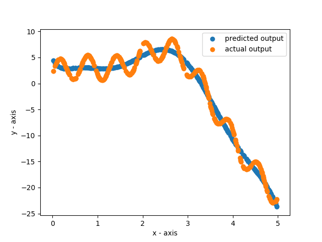

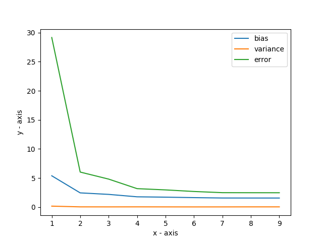

# Bias-Variance

## Algorithm implementation

For each degree from 1 to 9, we train 20 models according to the given training set data.

In order to fit a polynomial to the training data, we can use linear regression by transforming the features appropriately.

For x, if we create the features x<sup>2</sup>, x<sup>3</sup>, x<sup>4</sup> and so on, then we can use linear regression to get a polynomial.

We have done this using the sklearn.preprocessing.PolynomialFeatures class.

```python
# Convert x_data into polynomial features in order to use linear regression
poly = sklearn.preprocessing.PolynomialFeatures(deg)
x_data = poly.fit_transform(x_data)
```

We can now fit a regression model to the data:

```python
# Fit a regression model to the data
regression_model = sklearn.linear_model.LinearRegression().fit(x_data, y_data)
```

Now in order to make predictions from the data, we convert the test data into polynomial features also.

```python
# Convert the test data into a polynomial features in order to use the regression model
poly_X_test = poly.fit_transform(X_test)
```

Now we can make predictions:

```python
# Make predictons on the test data using the regression model
predictions = regression_model.predict(poly_X_test)
```

We maintain a running sum of square of predictions and sum of predictions

```python
# Update the running sum of square of predictions and mean of predictions
mean_square_predictions = np.add(
        mean_square_predictions, np.multiply(predictions, predictions))
mean_of_predictions = np.add(mean_of_predictions, predictions)
```

For each degree, treating the 20 models as different reaisations of the same model, we can calculate the bias and variance:

```python
    # Calculate bias from mean of predictions and Fx_test
    mean_of_predictions = np.multiply(mean_of_predictions, (1/20))
    bias = np.subtract(mean_of_predictions, Fx_test)
    bias_squared = np.multiply(bias, bias)
    bias_squared = np.mean(bias_squared)
    print("bias squared is ", bias_squared)
    bias_squared_array.append(bias_squared)

    # Calculate variance from mean square predictions and mean of predictions
    mean_square_predictions = np.multiply(mean_square_predictions, (1/20))
    variance = np.subtract(mean_square_predictions, np.multiply(
        mean_of_predictions, mean_of_predictions))
    variance = np.mean(variance)
    print("variance is ", variance)
    variance_array.append(variance)
```

Finally, we can plot a graph of the bias and variance of the data:

```python
# Plot on a graph
pyplot.plot(model_complexity, bias_squared_array, "b+-", label="Bias ^ 2")
pyplot.plot(model_complexity, variance_array, "r*-", label="Variance")
pyplot.legend()
pyplot.xlabel("Model complexity")
pyplot.title("Bias^2 and variance against model complexity")
pyplot.show()
```

## Results

```
Degree of the polynomial: 1
bias squared is  999228.3968719237
variance is  70545.4891457503

Degree of the polynomial: 2
bias squared is  954619.273794425
variance is  125870.85554877324

Degree of the polynomial: 3
bias squared is  9389.730116791241
variance is  150073.7395464763

Degree of the polynomial: 4
bias squared is  10907.348134071346
variance is  212235.70832526046

Degree of the polynomial: 5
bias squared is  9339.19429132604
variance is  276388.4802547399

Degree of the polynomial: 6
bias squared is  10248.585941147898
variance is  316863.4984374898

Degree of the polynomial: 7
bias squared is  10335.275861649114
variance is  357510.9847573545

Degree of the polynomial: 8
bias squared is  10149.419243937282
variance is  404286.67068578553

Degree of the polynomial: 9
bias squared is  10815.48703657425
variance is  459132.37837248656
```

## Plots

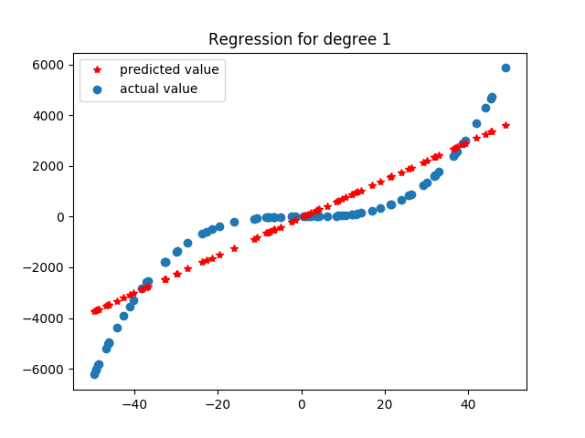
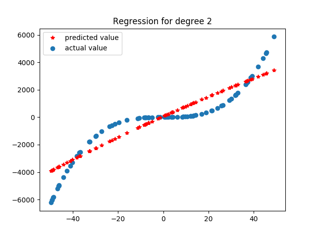
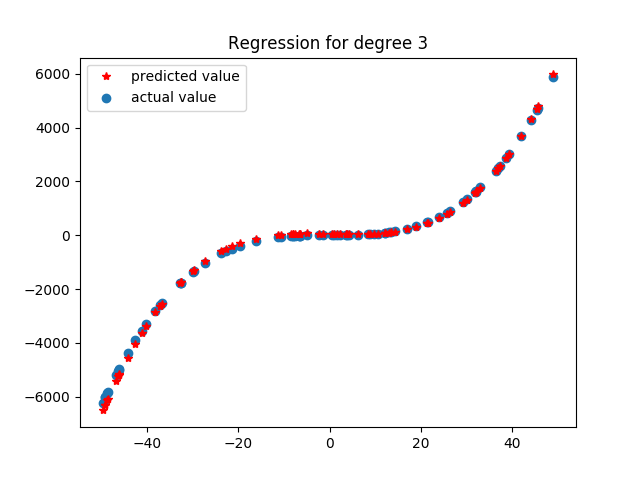
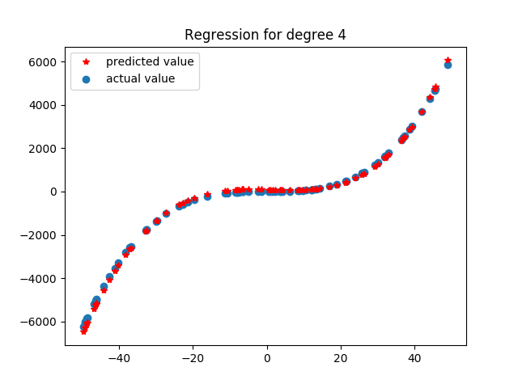
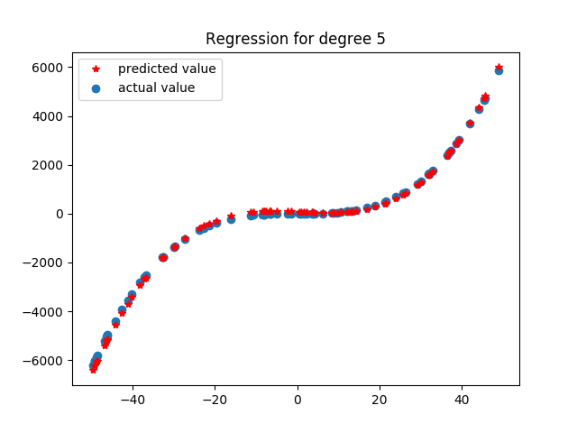

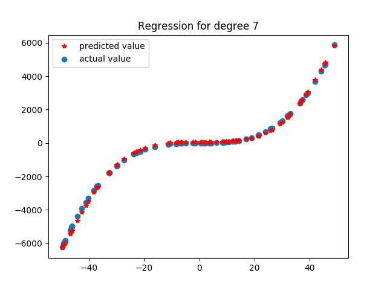
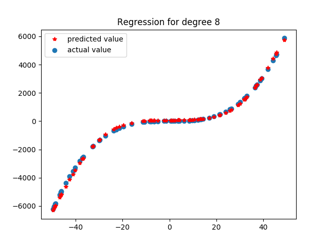
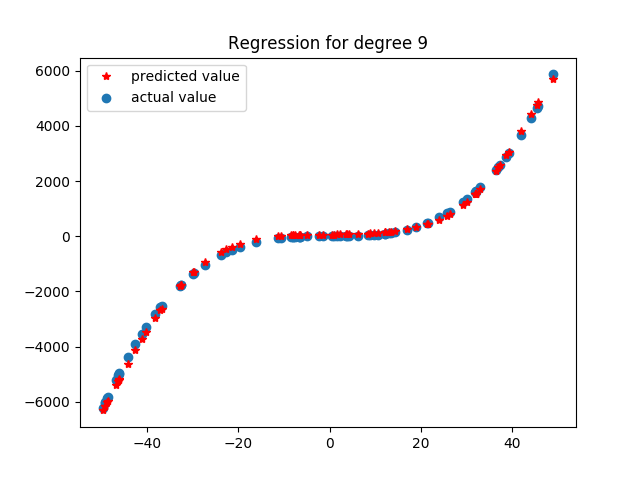

## Plot of Bias^2 and variance against model complexity
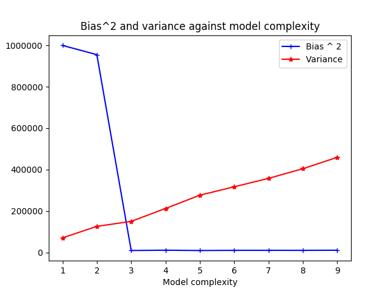

## Observations

We observe that bias^2 drops by a lot after we reach degree 3.\
We also see that the variance keeps increasing as the model compexity increases.